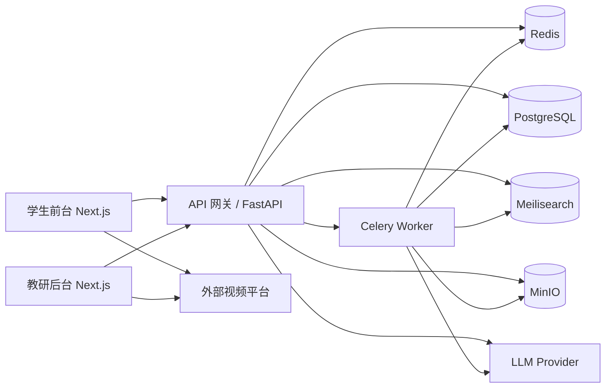

# K-12 Math Matrix 架构文档

## 1. 项目定位

K-12 Math Matrix 是一个面向中国大陆学生的数学知识内容平台，覆盖小学 1 年级到高中 3 年级，并额外承载竞赛/拔高内容。平台核心不是题库，也不是教务后台，而是一个以知识点为中心的学习系统，支持以下能力：

- 理论、公式、案例、技巧的结构化呈现
- 课标主干与竞赛拓展双主线知识组织
- 前置知识、后续知识、同核知识、应用知识之间的关系图谱
- 静态图、交互图、少量视频嵌入的多媒体讲解
- AI 辅助内容生产、人工编辑、审核发布的闭环流程

## 2. 架构目标

系统设计需要同时满足以下目标：

- 支撑大规模知识点建设，而不是只展示少量静态内容
- 前台页面可被搜索引擎收录，适合知识内容长期沉淀
- 内容与关系必须结构化，不能退化成一堆文章页
- 自托管可控，避免过度依赖第三方闭源服务
- 第一阶段可用模块化单仓推进，后续能够逐步平台化

## 3. 总体架构

系统采用前后端分离架构，包含 6 个核心层级：

- 学生前台：提供课程导航、搜索、知识点详情、图谱浏览、专题学习
- 教研后台：提供内容编辑、关系维护、媒体绑定、审核发布、版本回滚
- 业务 API：提供内容读写、关系查询、搜索聚合、审核流、AI 任务编排
- 异步 Worker：负责 AI 任务、索引刷新、缓存刷新、媒体后处理
- 基础服务：PostgreSQL、Redis、Meilisearch、MinIO
- 外部能力：大模型服务、外部视频托管平台

## 4. 核心子系统

### 4.1 学生前台

学生前台是内容消费入口，包含以下页面与能力：

- 首页：按学段、年级、专题展示入口
- 课程树页面：浏览课标主干与竞赛支线
- 知识点详情页：展示理论、公式、案例、技巧、图、视频、关联关系
- 搜索页：支持学段、年级、领域、难度、主线来源、标签联合筛选
- 图谱页：展示当前知识点的邻接图与学习路径
- 专题页：例如“平面几何核心模型”“函数思想进阶”

前台以只读查询为主，不直接承担复杂写操作。

### 4.2 教研后台

后台不是传统 CMS 的文章管理页，而是面向结构化知识资产的内容工作台。主要模块如下：

- 知识点编辑器：编辑理论、公式、案例、技巧、标签、适用年级
- 关系编辑器：管理前置、后继、同核、应用、扩展关系
- 媒体管理：上传图像、存储图规格、绑定视频链接与封面
- 审核中心：查看 AI 生成内容、待审内容、已发布版本
- 版本中心：对比版本差异、回滚历史版本
- 任务中心：查看 AI 生成任务、失败原因、人工补录状态

### 4.3 业务 API

业务 API 由 FastAPI 提供，分为三类能力：

- 内容查询 API：服务学生前台
- 内容管理 API：服务教研后台
- 异步任务 API：服务 AI 生成、索引更新、媒体处理

API 按领域模块划分：

- `curriculum`：课程树与年级体系
- `knowledge`：知识点主体内容
- `relations`：知识点关系
- `search`：搜索与筛选
- `media`：图片、图规格、视频元数据
- `review`：审核流
- `ai`：生成任务、结果回写、质检

FastAPI 负责同步 API、鉴权、参数校验和聚合查询，不承担长耗时任务。

### 4.4 异步 Worker

异步任务由 Celery Worker 承担，和 FastAPI 共享数据库模型与配置。Worker 负责：

- AI 初稿生成
- 内容质量校验
- 搜索索引更新
- 发布后缓存刷新
- 图片元数据抽取

这样设计的原因：

- 避免同步请求被长耗时任务阻塞
- 方便单独扩容 AI 与索引处理能力
- Python 生态更适合内容处理与 AI 工作流

### 4.5 基础服务

- PostgreSQL：主数据库，存知识实体、关系、版本、审核记录
- Redis：缓存、任务队列、节流、热点查询加速
- Meilisearch：全文搜索与筛选检索
- MinIO：图片、封面、导出资源等对象存储

### 4.6 外部能力

- LLM Provider：用于知识点初稿生成、内容改写建议、结构缺漏检查
- 视频平台：用于存储和分发讲解视频，平台只保存嵌入地址和元数据

## 5. 内容组织模型

平台采用“双主线”知识组织方式。

- 课标主干：按小学、初中、高中，按年级、模块、单元、知识点逐级组织
- 竞赛支线：按数论、组合、几何、代数、计数等专题组织
- 桥接关系：竞赛内容通过 `extends`、`same-core`、`application-of` 等关系挂接到课标主干

这样设计的目的：

- 保证主流学生可以顺着课标路径学习
- 保证拔高内容不破坏课标结构
- 保证同一个知识内核可以被多个学习路径复用

## 6. 核心业务流

### 6.1 学习浏览流

1. 用户选择学段或年级。
2. 前台请求课程树与推荐知识节点。
3. 用户进入知识点详情页。
4. 页面聚合正文、公式、案例、技巧、图、视频、关系节点。
5. 用户继续跳转到前置或后续知识点。

### 6.2 搜索检索流

1. 用户输入关键词或勾选筛选条件。
2. 前台调用 FastAPI 搜索接口。
3. 搜索服务从 Meilisearch 返回候选结果。
4. API 再从 PostgreSQL 聚合结构字段和展示摘要。
5. 返回排序后的知识点列表与筛选维度。

### 6.3 图谱关系流

1. 用户查看知识点详情页。
2. 前台请求当前节点的邻接关系。
3. API 返回前置、后继、同核、应用、拓展边。
4. 前端根据关系类型分层展示图谱。

### 6.4 内容生产流

1. 教研人员创建知识点模板。
2. AI 根据模板生成初稿。
3. 系统执行规则校验。
4. 编辑人工修订内容与媒体绑定。
5. 审核人员审核通过后发布。
6. 发布事件将索引更新与缓存刷新任务投递给 Celery Worker。

## 7. 多媒体架构

### 7.1 图片与静态图

- 静态说明图直接作为资源文件存储在 MinIO
- 几何作图优先保存为 SVG
- 每个图对应 `DiagramSpec`，记录类型、用途、关联知识点、可交互性

### 7.2 交互图

交互图不以“图片文件”为主，而以“可执行配置”表达。后端保存图元参数，前台用绘图库实时渲染。这样可以支持：

- 拖拽顶点
- 动态显示长度/角度
- 展示定理变化过程

### 7.3 视频

视频第一版不做站内转码与存储，只做外部嵌入。

- 平台保存 `VideoAsset`
- 字段包括封面、标题、平台来源、嵌入地址、时长、章节绑定
- 前台统一播放器壳层，底层走外部平台

## 8. 安全与权限

系统首版采用简单角色模型：

- `student`：只读访问已发布内容
- `editor`：创建、编辑、提交审核
- `reviewer`：审核、发布、回滚

安全边界要求：

- 只有已发布版本可对学生前台可见
- AI 输出不能跳过人工编辑和审核环节
- 所有重要操作必须保留审计记录
- 媒体资源需要与业务实体绑定，避免孤儿文件堆积

## 9. 部署拓扑

第一版部署采用 Docker Compose，自托管可控，便于快速启动：

- `web-student`
- `web-admin`
- `api`
- `worker`
- `postgres`
- `redis`
- `meilisearch`
- `minio`

后续平台化阶段再迁移到 K8s 或等价容器编排方案。

## 10. 演进策略

### 阶段一：内容平台 MVP

- 先打通知识点、关系、搜索、详情页、审核流
- 先支持少量交互图和外部视频嵌入
- 图谱先做局部邻接图，不做全量超大图可视化

### 阶段二：内容规模化

- 增加专题体系、错题回流、学习路径编排
- 增强 AI 质检与内容批量生成能力
- 提升后台编辑体验与关系维护能力

### 阶段三：平台化

- 加入个性化推荐、学习轨迹、内容分层分发
- 支持更精细的权限与组织协作
- 支持更丰富的交互数学实验内容

## 11. 验收标准

- 一个知识点能完整展示理论、公式、案例、技巧、静态图、交互图、视频
- 一个知识点能同时处于课标主干和竞赛支线的关系网络中
- 内容必须经过“创建 -> 生成/编辑 -> 审核 -> 发布”流转
- 搜索能按学段、年级、模块、标签、难度、主线来源联合筛选
- 发布后可同步更新搜索索引与前台内容缓存
